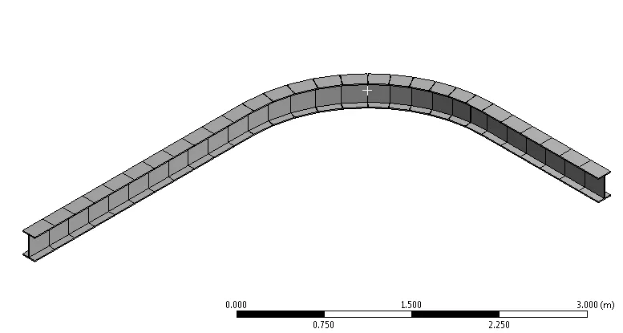
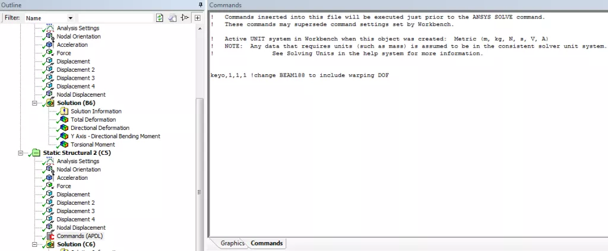
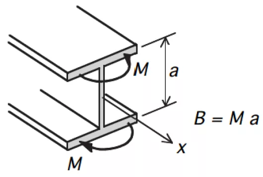

## Introduction to Warping of Open Sections

Warping of open sections is a challenging yet important area of structural engineering. Warping is important for open sections experiencing torsion, including (perhaps not immediately obvious) beams curved on plan (see Figure below) where torsion is induced due to the curved path the beam follows.

Industry guidance for curved beams can be found in SCI P281, Design of Curved Steel by The Steel Construction Institute. One suggested option is to activate the warping degree of freedom that is often deactivated as the default behaviour for most beam elements. This is explored below. The use of beam elements with an additional warping degree of freedom is considerably simpler than the alternative suggested in SCI P281 to use an I-beam represented with beam elements for the flanges and shell elements for the web.

> “Members curved on plan are subject to unusual load effects, and need careful design and detailing in order to provide satisfactory service.”— The Steel Construction Institute, P281, Design of Curved Steel

This [enlightening article](http://www.ramsay-maunder.co.uk/downloads/warping_article_web.pdf) shows the importance, and significance on the answer, of including the appropriate warping degree of freedom, and warping restraint, of open sections. It is particularly important for open sections such as I sections due to their low torsional stiffness.

## Warping in ANSYS Workbench

In ANSYS the warping of open sections represented with beam elements (e.g. BEAM188) is included by adding a 7th degree of freedom. But care is required as the default is to **not include** a warping degree of freedom in the element formulation. Also, in the ANSYS Workbench interface this is not obvious because there is no easy was to list the element defaults and options (KEYOPTs in APDL) and nor is it possible to include the warping degree of freedom for beam elements interactively.

That said, and this highlights the importance of understanding the underlying element formulation, if you know the equivalent APDL command then all the information is readily available and well-explained in the ANSYS Help Manual. Even if you choose to use the ANSYS Workbench interface, it is really important to understand the commands underpinning that analysis (which are plain old ANSYS APDL) so you can query the Help Manual and make an informed decision regarding element defaults and limitations. The easiest way to bridge the gap between ANSYS Workbench and ANSYS APDL is to write out the input text file from ANSYS Workbench by selecting the Solution branch and going to Tools – Write Input File. This writes a text file that you can view in any text editor and can use to explore the commands. You can use this to check element types, key options, nodal orientations, and other useful things like that that you just don’t have visibility of within Workbench.

Visibility of the input commands also then allows you to modify these commands using a Command Snippet. Currently that is the only way to include warping in ANSYS Workbench. The following Command Snippet will modify all elements with an `ETYPE` (element type ID) of 1 to include warping. You will have to modify and extend as appropriate if you have multiple element types and bodies in the model. One way to do this is to insert a Command Object under each body or part, which will allow you to use the `matid` material ID which will be equal to the `ETYPE` number. The Command Snippet works by changing KEYOPT(1) to 1, from the default of 0, for BEAM188 elements.

### Command Snippet to Include Warping in ANSYS Workbench

`keyopt,1,1,1 ! assuming you have just one element type, change TYPE 1 to have KEYOPT(1)=1`

## Post Processing Warping Quantities

Activating the warping degree of freedom will give an additional output quantity – warping bimoment. This warping bimoment can be converted to an equal and opposite bending moment in the plane of each flange by dividing the warping bimoment by the depth between the centroids of the flanges, as shown in the Figure below.

Determining the performance of open sections subject to bending and torsion can be found using the guidance in SCI P057, Design of Members Subject to Combined Bending and Torsion by The Steel Construction Institute. Even if you do turn on warping using the Command Snippet above, you must also be careful in the post-processing. Combined Stress as reported by the Beam Results tool does not give a true von Mises stress (it gives axial + bending only) and therefore if you need to know the von Mises stress including the effects of warping and torsion, then you need to use APDL to post-process the results.

It should be noted that modelling open beam sections using shell or solid elements will explicitly capture the warping behaviour (given sufficient mesh refinement), although there is less granularity in results , i.e. you will obtain a combined stress state, and cannot readily break this in to the component actions like major axis moment, axial force and warping bimoment, and so code checking can become more difficult.

## Considerations for Other Engineering Software

If you use other software, then take the time to understand how warping and torsion is included. As far as the author is aware, STAAD for example does not have a transparent way of including warping, and therefore may not be appropriate (without additional effort) to assess torsion of open section, including beams curved on plan.

## Closing Thoughts

This article highlights an implementation of warping for beam elements in ANSYS Workbench. Torsion is a deep subject, and this article just scratches the surface of a particular implementation with some considerations.

## References

1. SCI P281, Design of Curved Steel, The Steel Construction Institute2. SCI P057, Design of Members Subject to Combined Bending and Torsion, The Steel Construction Institute