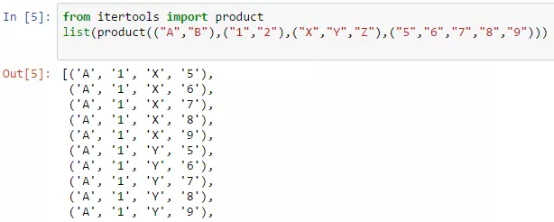

A while ago I was on the hunt for an Excel macro to create a list of all possible combinations of a number of variables. An example might be setting up load cases for finite element analysis where there are a number of variables or parameters which can have a range of values and a large number of possible combinations all the values. For example, a part might be subject to a “high”, “medium” or “low” load (3), and could have say four possible hole diameters (4) and three possible material specifications (3). The total number of unique combinations is 3*4*3=36. To write them all out for this simple example would not be too arduous, but if you had several more parameters, each with several possible values, then you can see how quickly the number of combinations can escalate.

I found this post here: [http://stackoverflow.com/questions/24788986/modifying-excel-vba-that-creates-all-possible-combinations-from-multiple-lists](http://stackoverflow.com/questions/24788986/modifying-excel-vba-that-creates-all-possible-combinations-from-multiple-lists) (all credit to spioter) which gave an excellent VBA macro to achieve what I was after.

An example of the macro in action is in the attached Excel sheet, showing how to list all the combinations.

{}List-all-Combinations-Macro.xlsm{}

A screenshot of the workbook is below:



## Python Alternative

This was all very well, but then I discovered you could do the exact same thing in a couple of lines of Python code using the “itertools” library:

```python
from itertools import product 
list(product(("A","B"),("1","2"),("X","Y","Z"),("5","6","7","8","9")))
```

The result:



Also check out the “permutations” function in the itertools library for similar functionality.

Python is reasonably new to me, but I can already see how it can make life easier, and it’s a very easy-to-learn and popular programming language. A great place to start is by downloading [Anaconda](https://www.continuum.io/anaconda-overview) with the excellent [Jupyter Notebook](http://jupyter.org/) where you can interactively run and review Python code very easily.