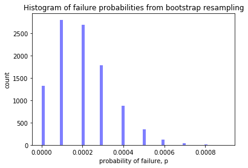
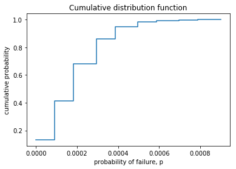
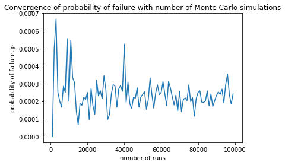
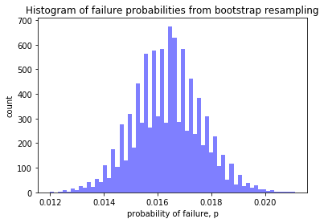
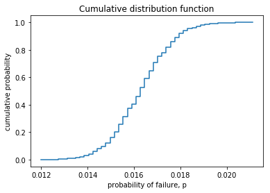
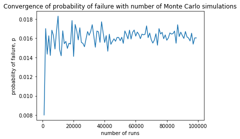

## NAFEMS Stochastic Working Group Challenge Problems 01 and 02
This page provides my solutions to the NAFEMS Stochastic Working Group challenge problems. These problems can be found [here](https://www.nafems.org/about/technical-working-groups/stochastics/challenge_problem/) I've used Jupyter notebooks to tackle the problems using the Python programming language. Jupyter notebooks provide a convenient way to interactively explore and run code. The notebooks are on Azure Notebooks where anyone can clone them and start exploring too, found here: [Azure Notebook files](https://notebooks.azure.com/nickjstevens/projects/stochastics-working-group).


## Challenge Problem 1
A material test specimen is to be subjected to a tensile load. The specimen has a nominal yield stress of 270 MPa. It must be guaranteed that the material remains in the elastic regime. Therefore a tensile stress of 210 MPa looks permissible for a particular application, since this is only 78% of the yield stress.

With respect to Uncertainty Quantification, the following data is available:
* Yield stress: mean value 270 MPa; standard deviation 13.5 MPa
* Tensile stress: mean value 210 MPa; standard deviation 10.5 MPa

Both stresses are assumed to be normally distributed.

### The Challenge
What is the probability that the tensile stress exceeds the yield stress?


```python
# install required additional libraries
!pip install astroML
```

    Requirement already satisfied: astroML in /home/nbuser/anaconda3_501/lib/python3.6/site-packages (0.4.1)
    Requirement already satisfied: matplotlib>=0.99 in /home/nbuser/anaconda3_501/lib/python3.6/site-packages (from astroML) (3.0.0)
    Requirement already satisfied: astropy>=1.2 in /home/nbuser/anaconda3_501/lib/python3.6/site-packages (from astroML) (3.0.4)
    Requirement already satisfied: scipy>=0.11 in /home/nbuser/anaconda3_501/lib/python3.6/site-packages (from astroML) (1.1.0)
    Requirement already satisfied: numpy>=1.4 in /home/nbuser/anaconda3_501/lib/python3.6/site-packages (from astroML) (1.16.2)
    Requirement already satisfied: scikit-learn>=0.18 in /home/nbuser/anaconda3_501/lib/python3.6/site-packages (from astroML) (0.20.3)
    Requirement already satisfied: cycler>=0.10 in /home/nbuser/anaconda3_501/lib/python3.6/site-packages (from matplotlib>=0.99->astroML) (0.10.0)
    Requirement already satisfied: kiwisolver>=1.0.1 in /home/nbuser/anaconda3_501/lib/python3.6/site-packages (from matplotlib>=0.99->astroML) (1.0.1)
    Requirement already satisfied: pyparsing!=2.0.4,!=2.1.2,!=2.1.6,>=2.0.1 in /home/nbuser/anaconda3_501/lib/python3.6/site-packages (from matplotlib>=0.99->astroML) (2.3.0)
    Requirement already satisfied: python-dateutil>=2.1 in /home/nbuser/anaconda3_501/lib/python3.6/site-packages (from matplotlib>=0.99->astroML) (2.8.0)
    Requirement already satisfied: six in /home/nbuser/anaconda3_501/lib/python3.6/site-packages (from cycler>=0.10->matplotlib>=0.99->astroML) (1.11.0)
    Requirement already satisfied: setuptools in /home/nbuser/anaconda3_501/lib/python3.6/site-packages (from kiwisolver>=1.0.1->matplotlib>=0.99->astroML) (41.1.0)
    WARNING: You are using pip version 19.2.2, however version 19.3.1 is available.
    You should consider upgrading via the 'pip install --upgrade pip' command.


```python
# import libraries
import numpy as np
import matplotlib.pyplot as plt
from astroML.resample import bootstrap
from statsmodels.distributions.empirical_distribution import ECDF
```

Now to define the functions we will need: 
 * one to run the simulation as a monte carlo technique, including the parameter distributions
 * the other to calculate the probability of "failure" from the MC simulations 
The distributions used for the MC function arr from the problem definition.


```python
def mc(runs):
    yieldx = np.random.normal(loc=270.0, scale=13.5, size=runs)
    tensilex = np.random.normal(loc=210.0, scale=10.5, size=runs)
    deltax = yieldx - tensilex
    return deltax

def failprob(mc):
    return sum(i < 0 for i in mc)/len(mc)
```

Now to run the simulation many times. As well as running the Monte Carlo simulation, which is the starting point, we also want to consider what the results mean.
For example, it soon becomes apparent that each time you run the MC simulation you get a different answer - **so what's the right answer**? There is also the notion that the more trials or runs the more accurate the results - **so how many runs is enough**?
To answer these two questions we'll follow up the MC simulation with a resampling technique called **bootstrapping**.
### Bootstrapping
Bootstrapping involves taking the MC results and resampling them with replacement many, many times, to build up a distribution of resukts from which we can simply look at the perecentiles to get an appropriate confidence interval. In a simple case like this there is no real difference or benefit from bootstrapping vs. just rerunning our MC simulation many times, but if you imagine that instead of a cheap MC simulation we had an expensive finite element analysis. That's where bootstrapping comes in and is hugely beneficial. 

After running the MC simulation we'll bootstrap the output and print the results. The probability output is not a %, but a probability between 0.0 and 1.0.


```python
%%time
NUM_RUNS=10000
# run MC simulation
runs = mc(NUM_RUNS)

# run bootstrap
samples = bootstrap(runs, 10000, failprob)
```

    CPU times: user 6.5 s, sys: 1min 48s, total: 1min 54s
    Wall time: 1min 57s


```python
# print out results
print(f"The Monte Carlo probability of failure is {failprob(runs):.5f} for {NUM_RUNS} runs.")
print(f"This amounts to {failprob(runs)*len(runs):.0f} failures in {NUM_RUNS} runs.")
print(f"The bootstrap resampled probability of failure is {np.mean(samples):.5f}.")
print(f"with 90% confidence interval of ({np.percentile(samples, 5):.5f},{np.percentile(samples, 95):.5f}).")
```

    The Monte Carlo probability of failure is 0.00020 for 10000 runs.
    This amounts to 2 failures in 10000 runs.
    The bootstrap resampled probability of failure is 0.00020.
    with 90% confidence interval of (0.00000,0.00050).


It can also be helpful to look at some charts to help understand the results. Below we look at a simple histogram of the probability of failure, an empirical cumulative distribution function, and a plot showing convergence with number of MC simulations. Notice that the histogram is not a normal distribution - it's skewed - capturing this behaviour is a key benefit of the bootstrap method. 


```python
# a histogram of the failure probabilities
plt.hist(samples, 60, facecolor='blue', alpha=0.5)
plt.title("Histogram of failure probabilities from bootstrap resampling")
plt.xlabel("probability of failure, p")
plt.ylabel("count")
plt.show()
```





```python
ecdf = ECDF(samples)
x = np.linspace(min(samples), max(samples))
y = ecdf(x)
plt.step(x, y)
plt.title("Cumulative distribution function")
plt.xlabel("probability of failure, p")
plt.ylabel("cumulative probability")
plt.show()
```





```python
%%time
x = [i for i in range(1000,100000,1000)]
y = [failprob(mc(i)) for i in x]
plt.plot(x, y)
plt.title("Convergence of probability of failure with number of Monte Carlo simulations")
plt.xlabel("number of runs")
plt.ylabel("probability of failure, p")
plt.show()
```





    CPU times: user 32.2 s, sys: 0 ns, total: 32.2 s
    Wall time: 32 s


##  Challenge Problem 2
The longitudinal strength of a ship can be assessed in a simple way by representing the ship as a beam with a varying cross section, following Archimedes’ law. The buoyancy is distributed along the beam, such that it is in balance with the varying weight. As a result, the beam is subjected to a varying Bending Moment, $BM$, where division by the varying Section Modulus, $SM$, gives a bending stress of:
$$ \sigma_b=\frac{BM}{SM} $$

This challenge problem represents the case of a damaged oil tanker. An explosion has ruptured the deck structure with the consequence that the resulting section modulus at this location is significantly decreased. Of course there is residual strength; however, to keep the bending stress within acceptable limits, the bending moment generated by sea waves must be carefully monitored whilst sailing in open water to reach the repair yard. Is the predicted sea state allowable?
Naval architects can alter the Still Water Bending Moment ($SWBM$) via changing the tank loading. The $SWBM$ is the static difference between weight and buoyancy. The sea state results in a continuously changing Wave Bending Moment ($WBM$). The expected sea state results in a maximum wave bending moment of:

* ${WBM} = 2.4$ GNm with deck in compression
* ${WBM} = 2.1$ GNm with deck in tension

Buckling of the damaged deck section must be avoided, and therefore the deck must be kept in tension. This means that the tank loading must result in a $SWBM = 2.4$ GNm with the deck in tension and prevent buckling during the wave action.
This condition results in a maximum tensile stress in the deck being induced by the maximum bending moment:
$SWBM + WBM$.
It is assumed that the ruptured deck has a reduced section modulus, $SM = 17.2$ m<sup>3</sup>, based on visual inspection. This results in a bending stress of:
$$ \sigma_b=\frac{SWBM+WBM}{SM} $$

Since sailing to the repair yard under careful monitoring may be considered as an exceptional condition, the allowable stress is raised to 90% of the yield stress. The steel has a yield stress of $315$ MPa, and this gives an allowable stress of $0.90 × 315 = 284$ MPa. Based on a deterministic analysis, the sea state is allowable and hence sailing to the repair yard is acceptable.
Uncertainty Quantification (UQ)
The parameters applied in the deterministic analysis contain uncertainty so each input value can be characterized by a distribution type with a mean value and a standard deviation. The input for UQ is presented in [Table 1](https://www.nafems.org/about/technical-working-groups/stochastics/challenge_problem/).
### The Challenge
Applying stochastic methods, what is the probability that the imposed bending stress $σ\_{b}$, exceeds the allowable yield stress $σ\_{yield}$?


```python
# install required additional libraries
!pip install astroML
```

    Requirement already satisfied: astroML in /home/nbuser/anaconda3_501/lib/python3.6/site-packages (0.4.1)
    Requirement already satisfied: scikit-learn>=0.18 in /home/nbuser/anaconda3_501/lib/python3.6/site-packages (from astroML) (0.20.3)
    Requirement already satisfied: astropy>=1.2 in /home/nbuser/anaconda3_501/lib/python3.6/site-packages (from astroML) (3.0.4)
    Requirement already satisfied: scipy>=0.11 in /home/nbuser/anaconda3_501/lib/python3.6/site-packages (from astroML) (1.1.0)
    Requirement already satisfied: matplotlib>=0.99 in /home/nbuser/anaconda3_501/lib/python3.6/site-packages (from astroML) (3.0.0)
    Requirement already satisfied: numpy>=1.4 in /home/nbuser/anaconda3_501/lib/python3.6/site-packages (from astroML) (1.16.2)
    Requirement already satisfied: cycler>=0.10 in /home/nbuser/anaconda3_501/lib/python3.6/site-packages (from matplotlib>=0.99->astroML) (0.10.0)
    Requirement already satisfied: kiwisolver>=1.0.1 in /home/nbuser/anaconda3_501/lib/python3.6/site-packages (from matplotlib>=0.99->astroML) (1.0.1)
    Requirement already satisfied: pyparsing!=2.0.4,!=2.1.2,!=2.1.6,>=2.0.1 in /home/nbuser/anaconda3_501/lib/python3.6/site-packages (from matplotlib>=0.99->astroML) (2.3.0)
    Requirement already satisfied: python-dateutil>=2.1 in /home/nbuser/anaconda3_501/lib/python3.6/site-packages (from matplotlib>=0.99->astroML) (2.8.0)
    Requirement already satisfied: six in /home/nbuser/anaconda3_501/lib/python3.6/site-packages (from cycler>=0.10->matplotlib>=0.99->astroML) (1.11.0)
    Requirement already satisfied: setuptools in /home/nbuser/anaconda3_501/lib/python3.6/site-packages (from kiwisolver>=1.0.1->matplotlib>=0.99->astroML) (41.1.0)
    WARNING: You are using pip version 19.2.2, however version 19.3.1 is available.
    You should consider upgrading via the 'pip install --upgrade pip' command.


```python
# import libraries
import numpy as np
import matplotlib.pyplot as plt
from astroML.resample import bootstrap
from statsmodels.distributions.empirical_distribution import ECDF
```

Now to define the functions we will need:
1. To calculate the bending moment using the formula from the problem definition
2. To calculate the bending stress
3. To run the simulation as a monte carlo technique, including the parameter distributions
4. To calculate the probability of "failure" from the MC simulations 
The distributions used for the MC function arr from the problem definition.


```python
def BM(SWBM, WBM):
    return SWBM + WBM

def sigma_b(BM, SM):
    return BM / SM

def mc(runs):
    SMx = np.random.normal(loc=17.2, scale=1.7, size=runs)
    SWBMx = np.random.normal(loc=2.4*10**3, scale=0.12*10**3, size=runs)
    WBMx = np.random.uniform(low=1.9*10**3, high=2.3*10**3, size=runs)
    phi = (17.0 ** 2 + 343.0 ** 2) ** 0.5
    mu = np.log(343.0 ** 2 / phi)
    sigma = (np.log(phi ** 2 / 343.0 ** 2)) ** 0.5
    yieldx = np.random.lognormal(mean=mu, sigma=sigma, size=runs)
    BMx = BM(SWBMx, WBMx)
    sigmax = sigma_b(BMx, SMx)
    deltax = yieldx - sigmax
    return deltax
    
def failprob(mc):
    return sum(i < 0 for i in mc)/len(mc)
```

Now to run the simulation many times. As well as running the Monte Carlo simulation, which is the starting point, we also want to consider what the results mean.
For example, it soon becomes apparent that each time you run the MC simulation you get a different answer - **so what's the right answer**? There is also the notion that the more trials or runs the more accurate the results - **so how many runs is enough**?
To answer these two questions we'll follow up the MC simulation with a resampling technique called **bootstrapping**.
### Bootstrapping
Bootstrapping involves taking the MC results and resampling them with replacement many, many times, to build up a distribution of resukts from which we can simply look at the perecentiles to get an appropriate confidence interval. In a simple case like this there is no real difference or benefit from bootstrapping vs. just rerunning our MC simulation many times, but if you imagine that instead of a cheap MC simulation we had an expensive finite element analysis. That's where bootstrapping comes in and is hugely beneficial. 

After running the MC simulation we'll bootstrap the output and print the results. The probability output is not a %, but a probability between 0.0 and 1.0.


```python
%%time
NUM_RUNS=10000
# run MC simulation
runs = mc(NUM_RUNS)

# run bootstrap
samples = bootstrap(runs, 10000, failprob)
```

    CPU times: user 5.73 s, sys: 3.52 s, total: 9.25 s
    Wall time: 9.25 s


```python
# print out results
print(f"The Monte Carlo probability of failure is {failprob(runs):.5f} for {NUM_RUNS} runs.")
print(f"This amounts to {failprob(runs)*len(runs):.0f} failures in {NUM_RUNS} runs.")
print(f"The bootstrap resampled probability of failure is {np.mean(samples):.5f}.")
print(f"with 90% confidence interval of ({np.percentile(samples, 5):.5f},{np.percentile(samples, 95):.5f}).")
```

    The Monte Carlo probability of failure is 0.01640 for 10000 runs.
    This amounts to 164 failures in 10000 runs.
    The bootstrap resampled probability of failure is 0.01639.
    with 90% confidence interval of (0.01440,0.01850).


It can also be helpful to look at some charts to help understand the results. Below we look at a simple histogram of the probability of failure, an empirical cumulative distribution function, and a plot showing convergence with number of MC simulations.


```python
# a histogram of the failure probabilities
plt.hist(samples, 60, facecolor='blue', alpha=0.5)
plt.title("Histogram of failure probabilities from bootstrap resampling")
plt.xlabel("probability of failure, p")
plt.ylabel("count")
plt.show()
```





```python
ecdf = ECDF(samples)
x = np.linspace(min(samples), max(samples))
y = ecdf(x)
plt.step(x, y)
plt.title("Cumulative distribution function")
plt.xlabel("probability of failure, p")
plt.ylabel("cumulative probability")
plt.show()
```





```python
%%time
x = [i for i in range(1000,100000,1000)]
y = [failprob(mc(i)) for i in x]
plt.plot(x, y)
plt.title("Convergence of probability of failure with number of Monte Carlo simulations")
plt.xlabel("number of runs")
plt.ylabel("probability of failure, p")
plt.show()
```





    CPU times: user 37.2 s, sys: 715 ms, total: 37.9 s
    Wall time: 37.7 s


And there we have it. I'd love to see other solutions too so I can learn from them. 
